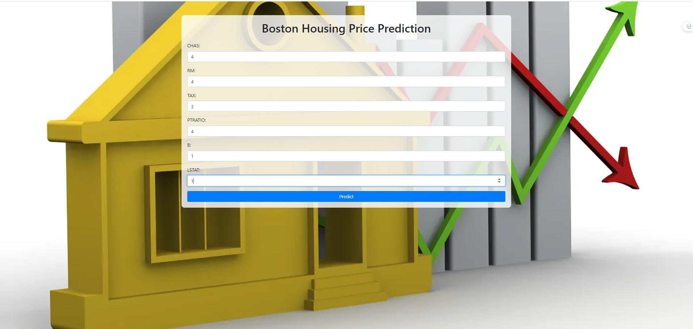

# Boston Housing Price Prediction

This project predicts the housing prices in Boston using a machine learning model.



## How to Use

1. Clone the repository.
2. Install the required dependencies.
3. Run the application.

## Requirements

- Python 3.7
- Flask
- Joblib
- Scikit-learn

## Running the Application

```bash
python app.py
```

Docker
To run the application using Docker:

```bash
docker build -t boston-housing .
docker run -p 5000:5000 boston-housing
```
